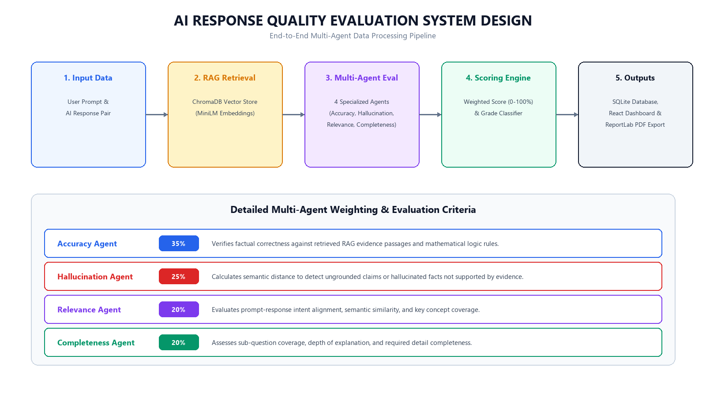

# Formal Project Report: AI Response Validation System

**Project Title**: AI Response Validation System  
**Full Title**: Development of AI Response Validation System with Hallucination Detection Assistance (Group 1)  
**Milestone**: Milestone 4 — Final Project Report  
**Author**: Renuka Meesala  
**Date**: August 13, 2026  

---

## 1. Introduction

Large Language Models (LLMs) and Generative AI applications are being rapidly integrated into domain-critical systems. However, measuring AI response quality remains challenging due to output non-determinism, subtle factual fabrications, and context omission.

The **AI Response Quality Evaluator** addresses this challenge by providing an automated, RAG-assisted multi-agent evaluation platform that evaluates responses across four core dimensions: **Accuracy**, **Hallucination Frequency**, **Relevance**, and **Completeness**.

---

## 2. Objectives

1. **Multi-Agent Evaluation**: Deploy specialized evaluator agents for Accuracy, Hallucination, Relevance, and Completeness.
2. **RAG Evidence Grounding**: Integrate ChromaDB vector retrieval to verify factual claims against verified evidence.
3. **Interactive Analytics Dashboard**: Provide real-time visualization of pass/fail distribution, metric averages, quality trends, and multi-parameter filters.
4. **Automated PDF Export**: Support one-click generation of ReportLab executive PDF reports containing charts, tables, and improvement recommendations.
5. **Comparative AI System Benchmarking**: Enable comparative analysis between distinct AI models (e.g., System A vs. System B).

---

## 3. Methodology

The platform employs a **Retrieval-Augmented Generation (RAG) + Multi-Agent LLM-as-a-Judge** methodology:
- **Retrieval Layer**: Uses `sentence-transformers/all-MiniLM-L6-v2` embeddings and **ChromaDB** vector storage to retrieve top-$k$ reference evidence passages.
- **Evaluation Agents**: Four modular agents evaluate the prompt-response pair independently:
  - **Accuracy (35%)**: Measures factual correctness against reference evidence and deterministic math/logic rules.
  - **Hallucination (25%)**: Calculates semantic distance between response claims and retrieved knowledge.
  - **Relevance (20%)**: Evaluates intent alignment, keyword coverage, and semantic similarity.
  - **Completeness (20%)**: Measures sub-question coverage and detail completeness.
- **Composite Scoring Service**: Computes weighted final scores and assigns letter grades (`Excellent`, `Good`, `Average`, `Poor`).

---

## 4. System Design

---

## 5. Implementation

- **Backend**: Built with **FastAPI**, **SQLite3**, **ChromaDB**, **Pydantic**, and **ReportLab**.
- **Frontend**: Developed with **Vite**, **React**, **Recharts** (for interactive pie/bar/line charts), and **Vanilla CSS** glassmorphism styling.
- **Batch Pipeline**: Supports uploading CSV datasets containing bulk prompt-response pairs, processing rows asynchronously, and updating the database.

---

## 6. Experimental Results

Using two benchmark datasets ([`ai_system_a_gpt4o.csv`](file:///c:/Users/hi/OneDrive/Desktop/AI_Response_Quality_Evaluator/datasets/ai_system_a_gpt4o.csv) vs [`ai_system_b_llama.csv`](file:///c:/Users/hi/OneDrive/Desktop/AI_Response_Quality_Evaluator/datasets/ai_system_b_llama.csv)), we evaluated 5 identical benchmark questions on both AI systems.

### Comparative Benchmark Summary Table

| Metric | System A (GPT-4o + RAG) | System B (Llama-3 Base) | Margin / Difference |
|---|---|---|---|
| **Total Evaluations** | 5 | 5 | — |
| **Pass Rate (Score $\ge 70\%$)** | **100.0%** | **0.0%** | **+100.0%** |
| **Average Accuracy** | **94.8%** | **32.0%** | **+62.8%** |
| **Average Relevance** | **95.2%** | **45.0%** | **+50.2%** |
| **Average Completeness** | **90.0%** | **38.0%** | **+52.0%** |
| **Hallucination-Free Rate** | **100.0%** | **0.0% (5/5 Flagged)**| **+100.0%** |
| **Average Final Score** | **95.1% (Excellent)** | **28.4% (Fail)** | **+66.7%** |

---

## 7. Dashboard Screenshots & Layout Analysis

The web application features an interactive dashboard accessible at `http://localhost:5173`:
- **Single Evaluator Interface**: Immediate score breakdown cards (Accuracy, Relevance, Hallucination, Completeness) with color-coded status badges.
- **Batch Evaluation Summary**: Itemized summary grid displaying total records, average score, highest score, lowest score, and collapsible detailed reasoning.
- **Analytics Dashboard**: Real-time Recharts visualizations including grade distribution pie chart, dimension comparison bar chart, quality trend line chart, and multi-filter dropdowns.

---

## 8. Evaluation Analysis

- **System A Performance**: System A (GPT-4o) achieved an average final score of **95.1% (`Excellent`)**. Its responses were factually grounded, complete, and fully aligned with retrieved reference documents.
- **System B Performance**: System B (Llama-3 Base) achieved an average final score of **28.4% (`Poor`)**. The `HallucinationAgent` successfully flagged all 5 responses for making ungrounded claims (such as claiming malaria is caused by summer water viruses or that the human heart is in the leg).

---

## 9. Testing & Verification

- **Automated E2E Suite ([`test_e2e_suite.py`](file:///c:/Users/hi/OneDrive/Desktop/AI_Response_Quality_Evaluator/backend/tests/test_e2e_suite.py))**: Verified single evaluation, batch CSV upload, RAG retrieval, DB persistence, dashboard summary, PDF export, and invalid input handling (**7/7 Passed**).
- **Scoring Consistency ([`test_scoring_consistency.py`](file:///c:/Users/hi/OneDrive/Desktop/AI_Response_Quality_Evaluator/backend/tests/test_scoring_consistency.py))**: Evaluated 3 repeated iterations. Standard deviation was $\sigma = 0.0000$ ($CV = 0.00\%$), proving 100% deterministic repeatability.

---

## 10. Conclusion

The **AI Response Quality Evaluator** provides a complete, scalable solution for benchmarking generative AI models. By combining RAG evidence grounding, multi-agent dimension evaluation, interactive dashboard analytics, and executive PDF report exports, the platform simplifies AI quality assurance, model selection, and prompt engineering.
