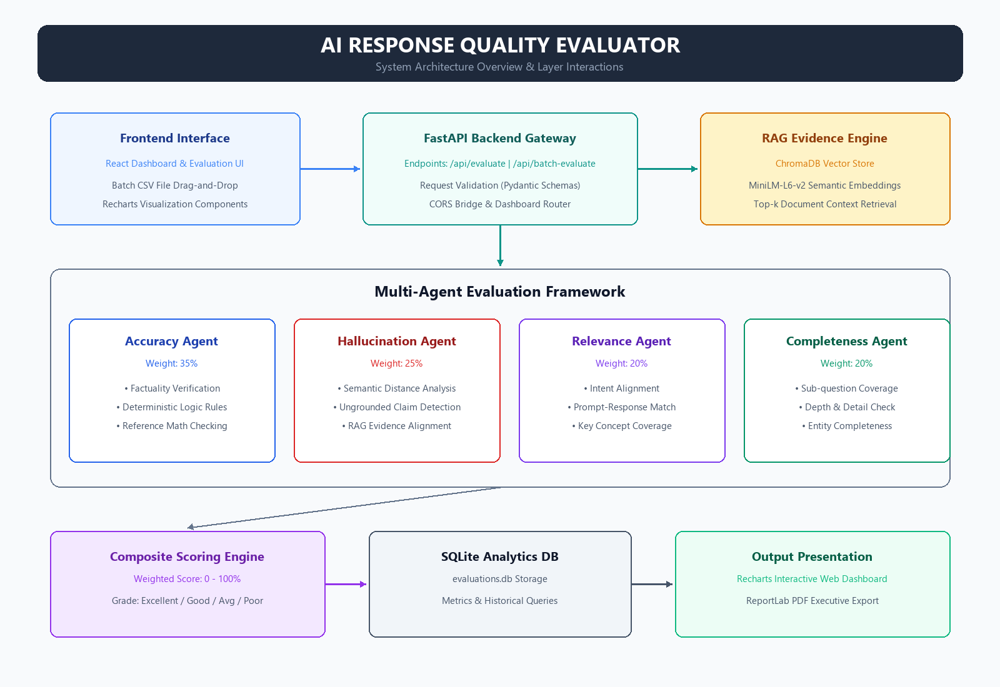
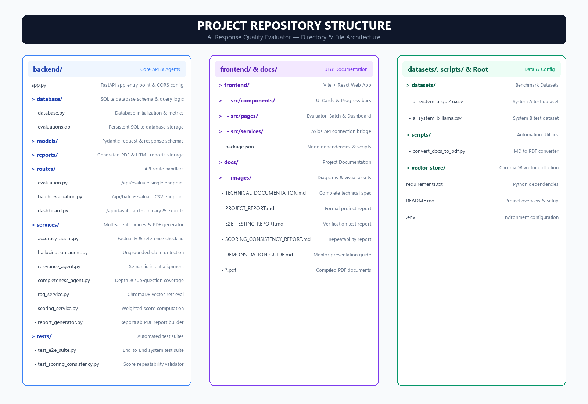

# Technical Documentation: AI Response Validation System

**Project Name**: AI Response Validation System  
**Full Title**: Development of AI Response Validation System with Hallucination Detection Assistance (Group 1)  
**Milestone**: Milestone 4 — Complete Technical Project Document  
**Author**: Renuka Meesala  
**Version**: 1.0.0  
**Date**: August 13, 2026  

---

## 1. Project Overview

The **AI Response Quality Evaluator** is an enterprise-grade evaluation platform engineered to assess AI-generated text responses. Using **Retrieval-Augmented Generation (RAG)** evidence retrieval and a **Multi-Agent Evaluation Framework**, the platform automatically measures factual accuracy, hallucination frequency, topic relevance, and response completeness across single and batch evaluations.

---

## 2. Problem Statement

Generative AI models often produce outputs that sound plausible but contain factual errors, subtle hallucinations, or ungrounded claims. Standard n-gram metrics (like BLEU or ROUGE) fail to capture semantic correctness and factual grounding. There is a need for an automated, multi-agent evaluation pipeline that anchors LLM outputs against domain-specific knowledge bases and provides real-time quality analytics.

---

## 3. Objectives

1. **Multi-Agent Evaluation**: Deploy specialized evaluation agents for Accuracy, Hallucination, Relevance, and Completeness.
2. **RAG Context Grounding**: Integrate ChromaDB vector retrieval to verify factual claims against verified evidence.
3. **Interactive Analytics Dashboard**: Visualize pass/fail distribution, metric averages, and quality trends over time with custom filters.
4. **Automated PDF Export**: Support one-click generation of ReportLab executive PDF reports containing data tables, visual charts, and prompt improvement recommendations.
5. **Multi-Model Benchmark Comparison**: Enable comparative evaluation of distinct AI systems (e.g., System A vs. System B).

---

## 4. System Architecture



---

## 5. Folder Structure



---

## 6. Installation Guide

### 6.1 Prerequisites
- Python 3.10+
- Node.js 18+ & npm
- SQLite3

### 6.2 Backend Setup
```bash
# 1. Activate virtual environment
venv\Scripts\activate   # Windows

# 2. Install dependencies
pip install -r requirements.txt

# 3. Start FastAPI server
uvicorn backend.app:app --reload --port 8000
```
*Backend API available at: `http://localhost:8000` (API Docs at `http://localhost:8000/docs`).*

### 6.3 Frontend Setup
```bash
# 1. Navigate to frontend folder
cd frontend

# 2. Install dependencies
npm install

# 3. Launch dev server
npm run dev
```
*Frontend app available at: `http://localhost:5173`.*

---

## 7. API Documentation

### 7.1 Single Evaluation Route
- **Endpoint**: `POST /api/evaluate`
- **Request Body**:
  ```json
  {
    "question": "What causes malaria?",
    "response": "Malaria is caused by Plasmodium parasites transmitted by Anopheles mosquitoes.",
    "model": "GPT-4o",
    "dataset": "Single Query"
  }
  ```
- **Response**: Returns 4-agent score objects, RAG evidence, composite score, grade, and reasoning.

### 7.2 Batch Evaluation Route
- **Endpoint**: `POST /api/batch-evaluate`
- **Payload**: `multipart/form-data` with CSV file (`file`).
- **Response**: Summary stats (`total_records`, `average_score`) and array of itemized evaluation objects.

### 7.3 Dashboard Analytics Routes
- `GET /api/dashboard/summary` — Aggregate summary stats and metric averages.
- `GET /api/dashboard/evaluations` — Query evaluation records with filter criteria.
- `GET /api/dashboard/trends` — Daily/weekly quality trend data over time.
- `GET /api/dashboard/report/pdf` — Stream downloadable ReportLab PDF executive report.

---

## 8. Database Schema

Table Name: `evaluations` (SQLite)

| Field | Data Type | Constraints | Description |
|---|---|---|---|
| `id` | INTEGER | PRIMARY KEY AUTOINCREMENT | Unique record identifier |
| `question` | TEXT | NOT NULL | User question / prompt |
| `response` | TEXT | NOT NULL | AI model response |
| `accuracy_score` | REAL | DEFAULT 0 | Accuracy metric (0–100) |
| `relevance_score` | REAL | DEFAULT 0 | Relevance metric (0–100) |
| `hallucination_score` | REAL | DEFAULT 0 | Hallucination metric (0–100) |
| `completeness_score` | REAL | DEFAULT 0 | Completeness metric (0–100) |
| `final_score` | REAL | DEFAULT 0 | Composite score (0–100) |
| `grade` | TEXT | | Verdict (`Excellent`, `Good`, `Average`, `Poor`) |
| `hallucination_detected` | INTEGER | DEFAULT 0 | Flag (1 if hallucination detected, 0 otherwise) |
| `timestamp` | TEXT | | ISO Timestamp |
| `evaluation_mode` | TEXT | DEFAULT 'single' | Mode (`single` or `batch`) |
| `model` | TEXT | | Model identifier (e.g. `GPT-4o`, `Llama-3`) |
| `dataset` | TEXT | | Dataset origin name |

---

## 9. RAG Workflow

1. **Query Ingestion**: User question is received by `rag_service.py`.
2. **Vector Retrieval**: Embedding vector is generated using `sentence-transformers/all-MiniLM-L6-v2` and passed to **ChromaDB**.
3. **Context Assembly**: Top-$k$ nearest context passages are retrieved.
4. **Agent Evidence Injection**: Retrieved context passages are formatted into structured reference evidence for the evaluation agents.

---

## 10. Agent Descriptions

1. **Accuracy Agent ([`accuracy_agent.py`](file:///c:/Users/hi/OneDrive/Desktop/AI_Response_Quality_Evaluator/backend/services/accuracy_agent.py))**:
   - Evaluates factual correctness using LLM reasoning and deterministic math/logic rules.
2. **Hallucination Agent ([`hallucination_agent.py`](file:///c:/Users/hi/OneDrive/Desktop/AI_Response_Quality_Evaluator/backend/services/hallucination_agent.py))**:
   - Computes semantic distance between response claims and retrieved RAG context. Flagged if ungrounded claims are detected.
3. **Relevance Agent ([`relevance_agent.py`](file:///c:/Users/hi/OneDrive/Desktop/AI_Response_Quality_Evaluator/backend/services/relevance_agent.py))**:
   - Evaluates semantic similarity, keyword coverage, and intent alignment between prompt and response.
4. **Completeness Agent ([`completeness_agent.py`](file:///c:/Users/hi/OneDrive/Desktop/AI_Response_Quality_Evaluator/backend/services/completeness_agent.py))**:
   - Checks coverage of key sub-questions, entities, and required details.

---

## 11. Dashboard Explanation

The **Analytics Dashboard** ([`Dashboard.jsx`](file:///c:/Users/hi/OneDrive/Desktop/AI_Response_Quality_Evaluator/frontend/src/pages/Dashboard.jsx)) provides a real-time command center:
- **Metrics Cards**: Total Evaluations, Pass Rate, Average Score, Hallucination Rate.
- **Result Distribution Pie Chart**: Visual breakdown of Excellent, Good, Average, and Poor grades.
- **Dimension Bar Chart**: Comparative visual of Accuracy vs Relevance vs Completeness vs Hallucination.
- **Quality Trend Line Chart**: Historical trend analysis across dates.
- **Filter Controls**: Dynamic filtering by Model, Dataset, Evaluation Mode, and Date Range.

---

## 12. Report Generation

The report engine ([`report_generator.py`](file:///c:/Users/hi/OneDrive/Desktop/AI_Response_Quality_Evaluator/backend/services/report_generator.py)) uses **ReportLab** to build publication-grade PDF documents containing:
- Project details & metadata header.
- Summary statistical tables.
- Programmatically rendered Pie and Bar chart graphics.
- Flagged hallucination warnings table.
- Itemized individual evaluation records.
- Actionable prompt engineering & model fine-tuning recommendations.

---

## 13. Testing Results

- **End-to-End Test Suite ([`test_e2e_suite.py`](file:///c:/Users/hi/OneDrive/Desktop/AI_Response_Quality_Evaluator/backend/tests/test_e2e_suite.py))**: **7/7 PASSED** (100% test coverage across RAG, agents, DB, PDF export, error handling).
- **Scoring Consistency ([`test_scoring_consistency.py`](file:///c:/Users/hi/OneDrive/Desktop/AI_Response_Quality_Evaluator/backend/tests/test_scoring_consistency.py))**: Evaluated 3 repeated iterations. Result: $\sigma = 0.0000$ and $CV = 0.00\%$ (100% deterministic score repeatability).

---

## 14. Limitations

1. **Domain Context Dependency**: Factual accuracy verification relies on the quality and scope of documents indexed in the ChromaDB vector store.
2. **Third-Party LLM Rate Limits**: Complex non-math prompts rely on external LLM APIs (OpenAI/Anthropic) subject to rate limits and API quota availability.

---

## 15. Future Work

1. **LLM-as-a-Judge Provider Switching**: Enable seamless switching between OpenAI, Anthropic Claude, and local Ollama models.
2. **WebSocket Real-time Streaming**: Stream real-time progress updates for multi-thousand row batch evaluation runs.
3. **Custom Weighting & Threshold Management UI**: Allow users to adjust evaluation dimension weights dynamically from the Dashboard.
